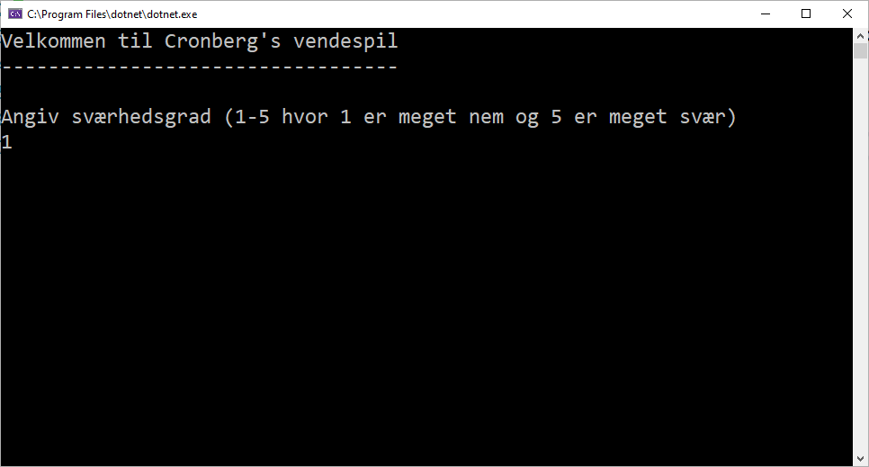
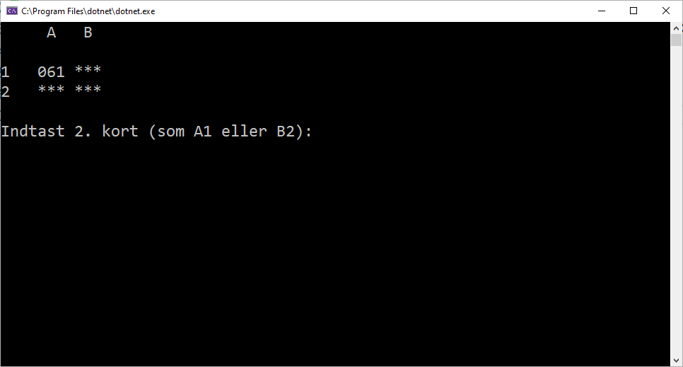
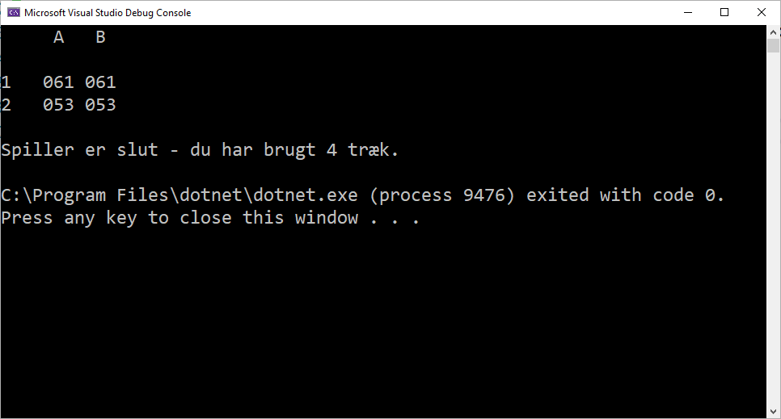
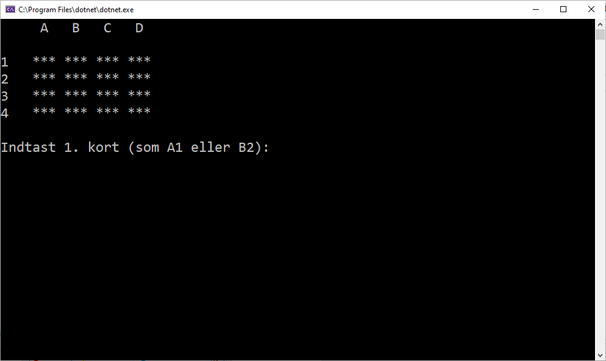
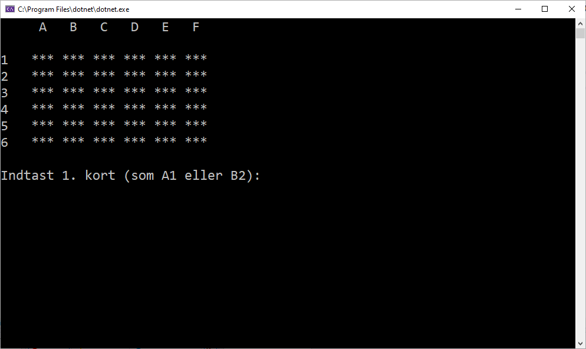
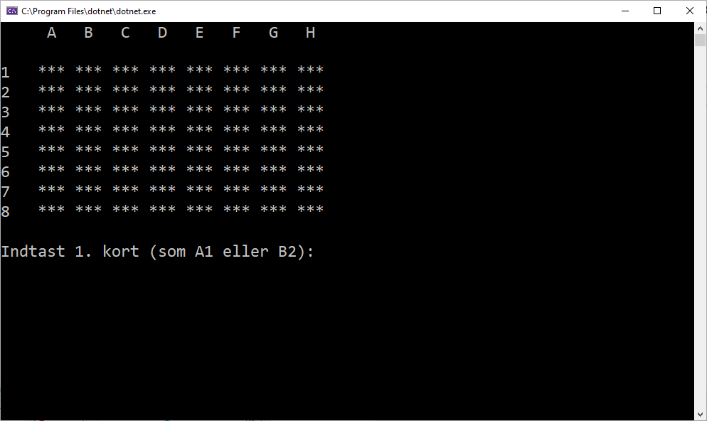
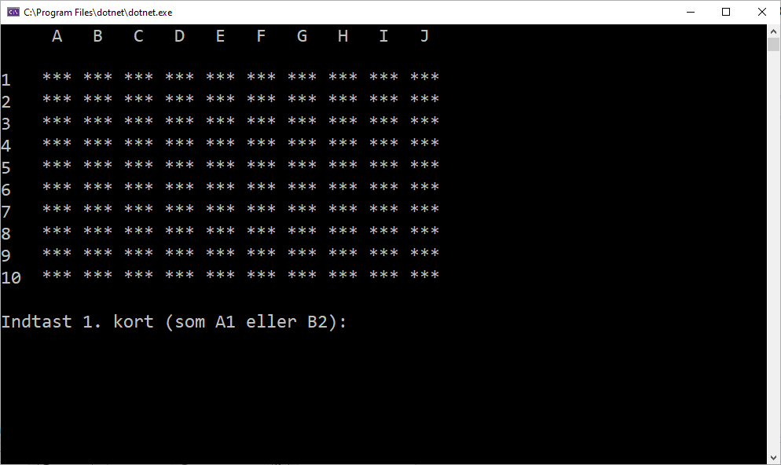

# Udvidet C#-opgave: Vendespil

I denne opgave skal du skabe et klassisk vendespil til afvikling på konsol. Det kunne se nogenlunde således ud - her i den nemme version:

Ved spillets start kan du vælge mellem 5 forskellige sværhedsgrader der bestemmer størrelsen på matrix med tal som skal gættes.

Se de forskellige muligheder her

    
    
    
    
    

Den nemmeste måde at få en idé om opgaven er selv at spille spillet - du kan hente [en kompileret version i vendespil.zip](https://github.com/devcronberg/os-cs-consolevendespil/releases/latest) eller blot afvikle projektet i VS ved at clone hele repository'et.

## Opgave

Du kan løse opgave præcis som du vil - der er hel fri leg - men jeg har løst den som følger:

- klasse [VendeKort](ConsoleVendespil/VendeKort.cs) som repræsenterer det enkelte kort (tal, vist forside eller bagside med en [enum](ConsoleVendespil/VendeKortSide.cs))
- klasse [VendeKortSpil](ConsoleVendespil/VendeKortSpil.cs) som repræsenterer spillet - herunder gemmer kort i en matrix (2 dimensionelt array), holder styr på antal træk mv
- klasse [ConsoleFunktioner](ConsoleVendespil/ConsoleFunktioner.cs) med lidt hjælp til input på konsol

men opgaven kan løses på mange forskellige måder. Om du bliver inspireret af min løsning eller starter helt fra bunden er helt op til dig.

God fornøjelse

Michell

