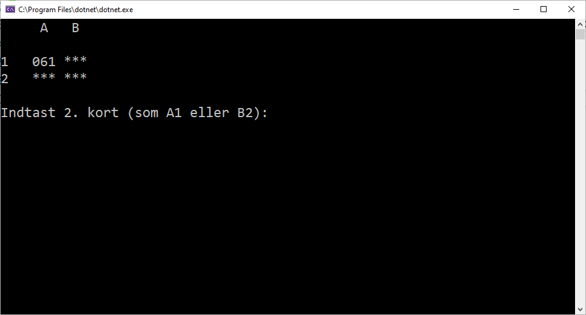
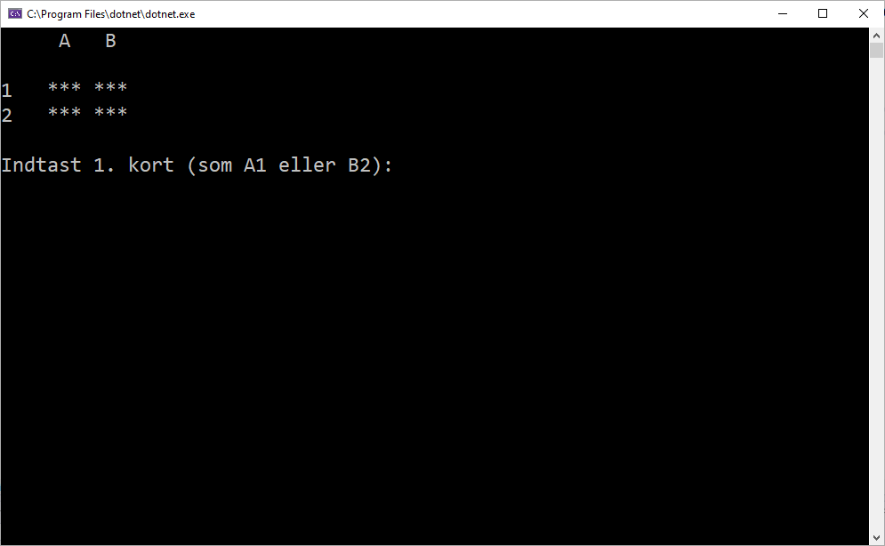
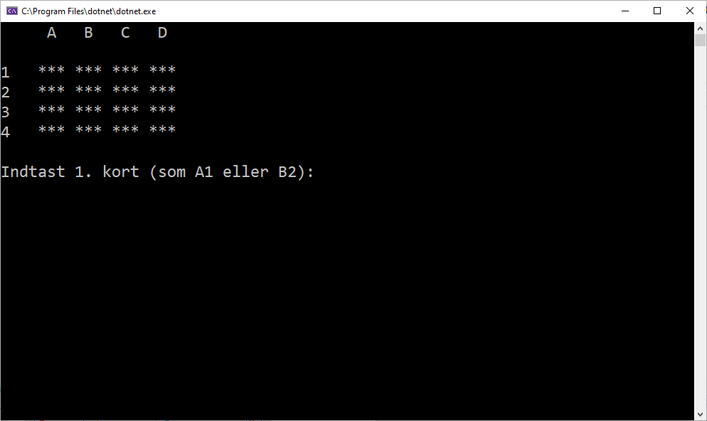
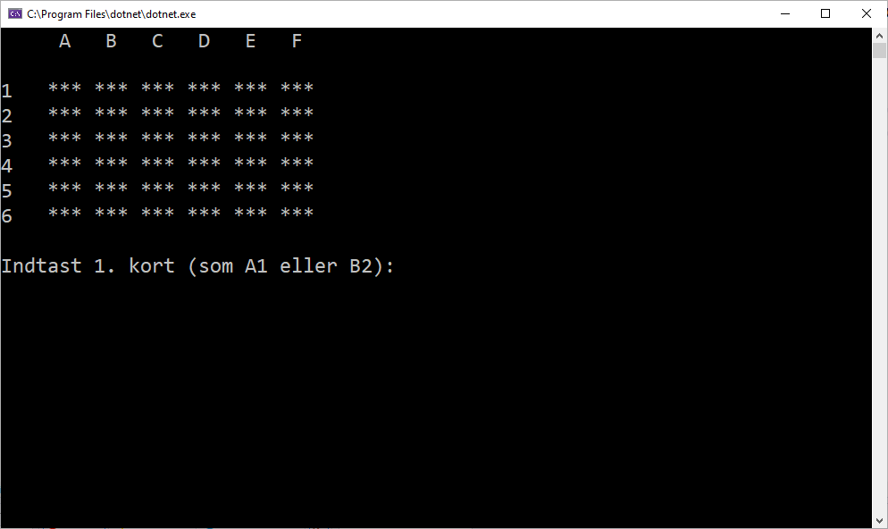
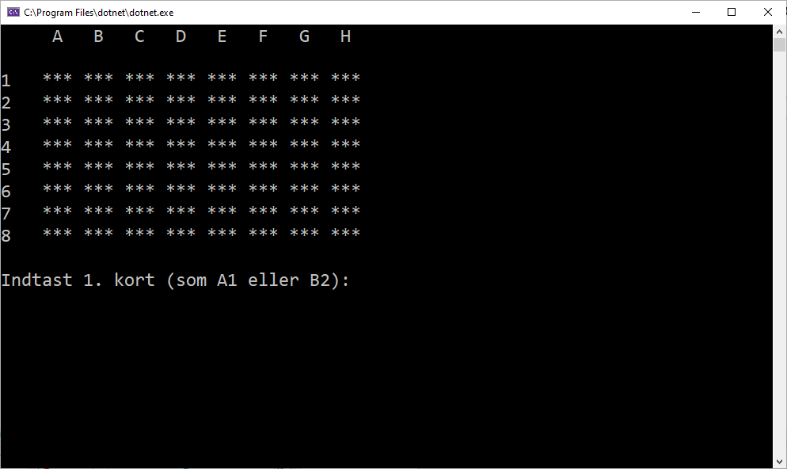
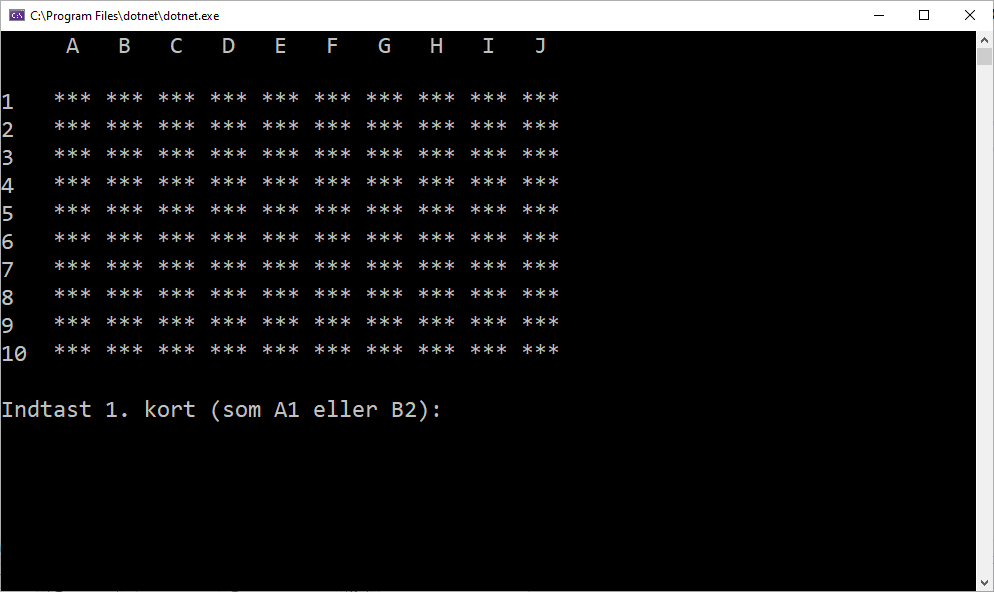

# Udvidet C#-opgave: Vendespil

I denne opgave skal du skabe et klassisk vendespil til afvikling på konsol. Det kunne se nogenlunde således ud - her i den nemme version:

Ved spillets start kan du vælge mellem 5 forskellige sværhedsgrader:

  

